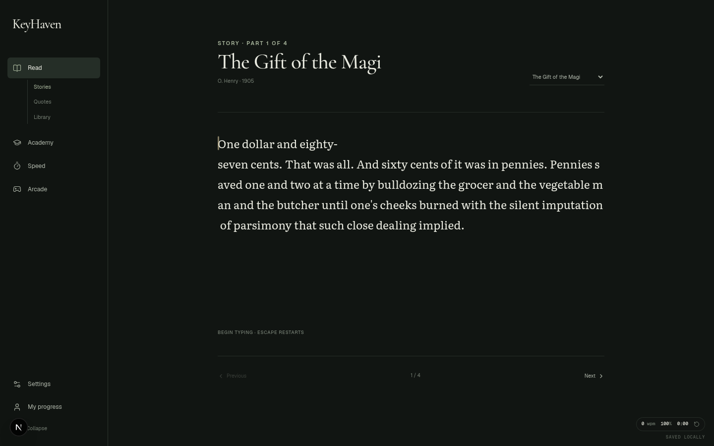

<div align="center">

# KeyHaven

### A quiet place to read, type, and improve.

KeyHaven is a minimalist typing workspace built around focused reading. Practice with literature, build technique through an adaptive academy, measure speed, or unwind in the arcade—all without turning the screen into a dashboard.

[](https://nextjs.org/)
[](https://react.dev/)
[](https://www.typescriptlang.org/)
[](#local-first-by-default)

</div>



## What makes KeyHaven different

Most typing apps place controls, charts, and live metrics at the center of the experience. KeyHaven keeps the prose there instead. Its interface uses a restrained sidebar, literary typography, page-like reading surfaces, and a tiny optional stats display so attention stays on the next character.

| Space | Purpose |
| --- | --- |
| **Read** | Type through stories, quotations, built-in books, EPUBs, and PDFs in a distraction-free reader. |
| **Academy** | Follow an adaptive beginner-to-advanced curriculum shaped by placement and weak-key analysis. |
| **Speed** | Run timed or word-count tests in a stable three-line viewport and compare verified results. |
| **Arcade** | Practice through Alphabet Sprint, Word Rain, Ghost Racer, and a rotating daily challenge. |

## Highlights

### A reader designed for typing

- Page-by-page presentation for stories, quotations, and books
- Upcoming prose remains clear while completed text gently recedes
- Stable overlay caret that never shifts line wrapping while you type
- Literary line-break hyphens in reading modes and atomic whole words in competitive modes
- Adjustable typeface, text size, line spacing, margins, page tone, and caret style
- Optional cherry blossom, misty mountain, quiet lake, and soft forest scenery
- Readability veil and soft-focus controls for scenic backgrounds
- Persistent book, chapter, and character-level reading progress

### Bring your own library

Import EPUB or PDF files directly in the browser. KeyHaven extracts and normalizes their text into typing-ready sections, with OCR fallback for scanned PDF pages.

- EPUB spine-order and metadata extraction
- Native PDF text extraction
- English OCR for image-only pages
- Import progress, cancellation, and clear error states
- 50 MB file limit and 500-page PDF limit
- Original files remain on the device; only normalized text can be synced

### Practice that grows with you

The Academy includes a placement assessment, adaptive daily plan, weak-key drills, mastery tracking, practice goals, and a twelve-stage course spanning fundamentals through endurance.

### Tests that behave like tests

Speed mode supports 15, 30, 60, and 120-second sessions or 10, 25, 50, and 100-word sessions. Punctuation and numbers are optional. The active line stays centered inside an exact three-line viewport, timers end once at their real deadline, and results include WPM, raw WPM, accuracy, consistency, and error data.

## Local-first by default

KeyHaven works without an account or server database. Settings, reading progress, imported text, Academy state, typing history, and arcade scores are stored in IndexedDB through Dexie.

Cloud mode is optional. When configured, signed-in users can sync their normalized library text and progress across devices, maintain a public handle, and participate in leaderboards. Email/password and Google sign-in are supported; password-reset email is delivered through Resend.

## Getting started

### Requirements

- Node.js 20.9 or newer
- npm
- A modern browser with IndexedDB support

### Run locally

```bash
git clone https://github.com/taherali181/keyhaven.git
cd keyhaven
npm ci
npm run dev
```

Open [http://localhost:3000](http://localhost:3000). No environment variables are required for guest, local-first use.

### Useful commands

```bash
npm run dev                 # Start the development server
npm run typecheck           # Check TypeScript
npm run lint                # Run ESLint
npm test                    # Run the Vitest suite
npm run test:e2e            # Run Playwright browser tests
npm run build -- --webpack  # Create the verified production build
npm start                   # Serve the production build
```

Playwright is configured to use Google Chrome at `/usr/bin/google-chrome`. Change `launchOptions.executablePath` in `playwright.config.ts` if Chrome is installed elsewhere.

## Optional accounts and cloud sync

Copy the example environment file:

```bash
cp .env.example .env.local
```

Then configure the values you need:

| Variable | Required for | Description |
| --- | --- | --- |
| `DATABASE_URL` | Accounts and sync | PostgreSQL connection string; Neon is the current serverless driver. |
| `NEXT_PUBLIC_KEYHAVEN_CLOUD` | Accounts and sync | Set to `true` to enable client-side cloud synchronization. |
| `AUTH_SECRET` | Authentication | A strong random secret used by Auth.js. |
| `AUTH_GOOGLE_ID` | Google sign-in | Google OAuth client ID. |
| `AUTH_GOOGLE_SECRET` | Google sign-in | Google OAuth client secret. |
| `AUTH_RESEND_KEY` | Password recovery | Resend API key used to send reset links. |
| `AUTH_EMAIL_FROM` | Password recovery | Verified sender identity for reset emails. |

Apply the checked-in Drizzle migrations before starting a cloud-enabled deployment:

```bash
npm run db:migrate
npm run dev
```

Google OAuth and Resend are optional. Email/password registration and database-backed synchronization require `DATABASE_URL`; password-reset delivery additionally requires Resend.

## Project structure

```text
keyhaven/
├── drizzle/                    # Versioned PostgreSQL migrations
├── public/backgrounds/         # Reader scenery assets
├── src/
│   ├── app/                    # Next.js routes, auth pages, and API handlers
│   ├── components/
│   │   ├── reader/             # Stories and quotations
│   │   ├── library/            # Books, imports, and saved progress
│   │   ├── learn/              # Adaptive Academy
│   │   ├── speed-test/         # Timed and word-count tests
│   │   ├── arcade/             # Typing games and daily challenge
│   │   ├── analytics/          # Progress and leaderboards
│   │   └── typing/             # Shared typing surface, caret, and results
│   ├── hooks/                  # Typing engine, settings, sound, and sync
│   ├── lib/                    # Browser storage, metrics, imports, and styles
│   └── server/                 # Drizzle schema, challenges, and rate limits
└── tests/                      # Unit, integration, and browser acceptance tests
```

## Technology

- **Application:** Next.js 16 App Router, React 19, TypeScript
- **Interface:** Tailwind CSS 4, custom CSS, Framer Motion, Lucide
- **Local data:** Dexie and IndexedDB
- **Cloud data:** PostgreSQL, Neon serverless driver, Drizzle ORM
- **Authentication:** Auth.js, Google OAuth, bcrypt credentials
- **Documents:** JSZip, PDF.js, Tesseract.js
- **Quality:** Vitest, Testing Library, Playwright, ESLint

## Quality and accessibility

The automated suite covers typing-engine completion semantics, strict mode, absolute timer deadlines, challenge validation, document importing, responsive overflow, reader contrast, stable line layout, speed-test viewport behavior, and core navigation flows.

The interface also includes visible keyboard focus, reduced-motion support, semantic labels, keyboard-first typing input, responsive mobile navigation, and a distraction-free Zen mode.

## Data and privacy notes

- Guest data stays in the browser unless cloud mode is enabled and the user signs in.
- Imported EPUB and PDF binaries are not uploaded by the application.
- Cloud sync stores extracted plain-text sections when enabled.
- OCR runs in the browser and may download Tesseract language assets when first needed.
- Leaderboard visibility is controlled through the user profile.

## Current status

KeyHaven is under active development. The local-first experience is ready to run immediately. Account creation, cloud synchronization, Google OAuth, password email, and hosted leaderboards require the external services described above.

---

<div align="center">
  Built for deliberate practice and quieter screens.
</div>
